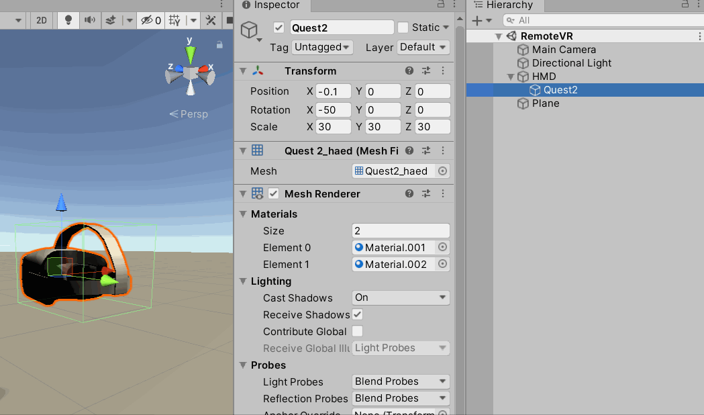
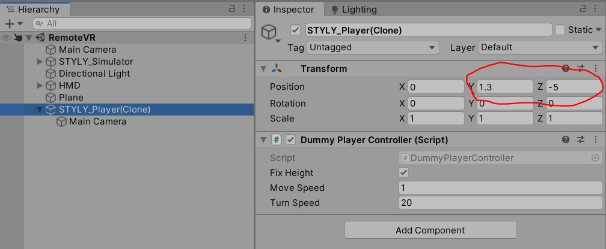
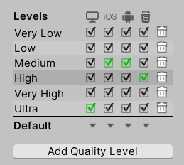
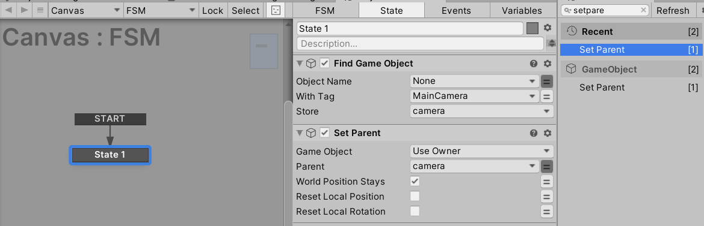
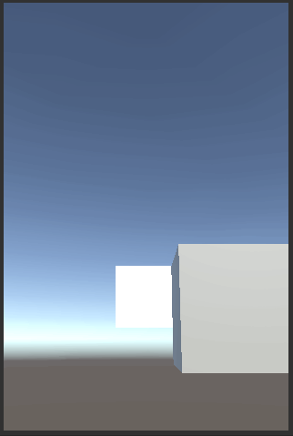
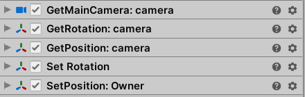
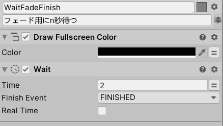
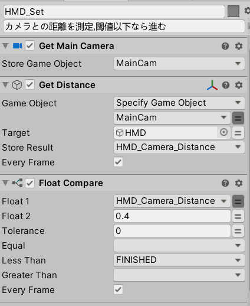

# Styly初挑戦

## バージョン情報

| 諸々名前 | バージョン |
|:-:|:-:|
|  Unity | 2019.3.6f1  |
|  STYLY Plugin | 1.3.0  |

---

## やること
- シーンのアップロード、公開などの基本操作習得  
- 簡単なインタラクションの習得  
  - 物を動かす、座標を移動させる
  - 物を持つ
  - 触ると動く、当たり判定的な  
  - AをBに接触させるとCが起こる  
- PlayMakerの習得
  - カメラの位置の取得、それに応じた処理
- 必要なShaderが問題なく動くか確認  

---

## 作りたい物(案)

### ■リモートワーク in VR
VR空間の中でVR空間に入るという体験を構築する。まあ割とありがち。  
VR空間内でHMDを被らせるのは普通ならやらないダサいUXだが、それをあえてやる。  
伝えたいメッセージは「リモートワーク」、「コロナ禍での真の働き方改革」。  

**【流れ、イメージ】**  
PCの前にHMDが置いてある。PCには会議への招待ダイアログが出ている。  
HMDを被る(頭に接触させる)と別の空間にワープする。
移動先は会議室。そこでは同僚や部下、上司がアバターで参加しており、仕事の打ち合わせを行う。その空間内には時間の概念があり、会議の終了時間になると自動的にワープで自宅に転送される。繰り返すうちに現実がどっちかわからなくなって...  

[シーケンス](ReadME_PDF/Sequences.pdf)

**【必要な素材】**
- 簡素な自宅の部屋
- HMDの3Dモデル
- PCの3Dモデル
- 会議室の3Dモデル
- ワープ演出、エフェクト
- 会議の音、人の声、ワープ音などサウンド

■候補  
[Simple Office](https://assetstore.unity.com/packages/3d/props/interior/simple-office-28730?locale=ja-JP)  
[Home Furniture Pack](https://assetstore.unity.com/packages/3d/props/furniture/home-furniture-pack-137357)  
[HQ ArchViz Conference Room](https://assetstore.unity.com/packages/3d/environments/hq-archviz-conference-room-127663)  
[Modern Interier Room Pack Vol.1](https://assetstore.unity.com/packages/3d/environments/modern-interier-room-pack-vol-1-77021)  
[Notebook PC（PBS）](https://assetstore.unity.com/packages/3d/props/electronics/notebook-pc-pbs-133020)  
[YGS TV](https://assetstore.unity.com/packages/3d/props/electronics/ygs-tv-96583)  
[Modern Desk](https://assetstore.unity.com/packages/3d/props/interior/modern-desk-155462#description)  
[City Street Skyboxes Vol. 1](https://assetstore.unity.com/packages/2d/textures-materials/sky/city-street-skyboxes-vol-1-157401)  


---

## 参考リンク
- [UnityからSTYLYにプレハブとシーンをアップロードする方法](https://styly.cc/ja/manual/unity-asset-uploader/)  
- [STYLY インタラクションSDK マニュアル](https://styly.cc/ja/manual/interaction_sdk_manual/)  
- [【Unity入門】PlayMakerを使った初めてのゲーム作り 概要とインストール](https://styly.cc/ja/tips/unity-playmaker-game-beginner-1/)
- [【Unity】ゼロからわかるPlayMaker「超」入門 基礎知識](https://styly.cc/ja/tips/playmaker_coreconcepts/)


---

## 詰まったところ、疑問点など


### Editor上からVRでの見え方を確認したい  

下記で解決。  
[STYLYローカルプレビューツール 「UnityシーンをSTYLY StudioにアップロードせずにSTYLY VR アプリで動作確認する方法」](https://styly.cc/ja/manual/styly-local-preview-tool/)  

---

### STYLY_Attr_Equipmentで良い感じに物を持ちたい

実機上でPreviewするとコントローラーと同じ角度に追従した。  
Editor上のシミュレートは40度回転していた。  

```cs
private void MovePosition() 
{
  Vector3 mousePos = Input.mousePosition;
  mousePos.z = distanceFromCamera;

  moveTo = mainCamera.ScreenToWorldPoint(mousePos);
  transform.position = moveTo;
  transform.rotation = mainCamera.transform.rotation;
  transform.eulerAngles += new Vector3(-40,0,0 );
}
```

なので、親オブジェクトの配下に物を置いて持った時に気持ちよくなる角度を探した。   

親に一つ空のオブジェクトを用意。親にIsTriggerにチェックを入れたColliderを用意し、掴むようにした。Blenderで回転いじっても良いが、面倒だったのでこれで対応。  



Colliderが2つあるから？なのか稀に右クリックでのオブジェクトのリリースが反応しないことがあった。  

親の原点から子の3Dモデルの原点を少しずらして、右端を持つようにした。  
左利き対応はたぶんできないだろうと諦めた。


---

### Playerの原点
**Q.Playerの原点のZ座標が-5なのは何故か？**
Editor上でMainCameraの位置を-5にしておくとゲームビュー及びシーンビューが実機転送時・PlayMode時と同様の位置関係になった。  


---

### 影の品質
影の品質がプラットフォームごとにデフォルトで異なっていたので  
WebGLのPlayerと実機での品質の違いにアップロード＆実機でプレビューして気付いた。  


Editor上で行ったWebGLの設定がWebPlayer上では反映されていなかった。  
**Q.WebのPlayerに影の設定を反映させるには？**

下記のように描画距離を絞って影の品質を上げたい。  
【参考リンク】：[2-2 City](https://gallery.styly.cc/scene/074fbc78-39ad-4814-94d1-d681df8d565b)

---

### Lightingが実機とEditorで異なる

>STYLYの仕様上、Point Lightの「Render Mode」を「Important」に設定しないとライトが機能しない

【引用元】：[【Unity】グローバルイルミネーション（GI）基礎知識～STYLYへの反映方法](https://styly.cc/ja/tips/gi-room_yosh_gi/)

けっこうハマった。Preview前、Upload前にLightコンポーネントの設定を自動で変更してくれたら便利だと思った。

---

### カメラにUIを追従させたい
目的はフェードインアウトを実装すること。その手段としてUIをカメラの目の前に追従させたかった。  
(意外とStyly上でのフェードインアウトの記事が見当たらなくて、自分のやろうとしていることを疑った)

HierarchyでMainCameraの配下にWorldCanvasを置けば良いと思ったが、  
STYLY_Player(Clone)が動的に生成され、配下にカメラがついて回る仕組みだったのでPlayMakerで実装した。

下記のような記事があったが、そこまで厳密でUIUXに準拠した追従を求めていなかったのでカメラをシーン内から探してその子にUIを配置する仕組みにした。

【参考リンク】：[[Unity/Playmaker]ユーザーに追従するUIの実装方法](https://styly.cc/ja/tips/playmaker_following_ui/)

  

~~Editor上でもシミュレートしたかったので、シーン上通常のカメラはタグを外し、  
Playerのカメラをタグで検索するようにした。~~  
→既存のMainCameraはPlay時に[自動でオフ](https://styly.cc/ja/manual/styly_important_point/)になっていた。
  

~~アップロード時のシーンのスクショが真っ黒になったのでたぶん正攻法じゃない。  
ただ、そこはあまり問題にならないのでOK。~~  

ここまでのカメラの子にUIを追加する手法は次のシーンへ子オブジェクトが持ち越される？ことを懸念してか、[非推奨](https://document.styly.cc/doc/docs/en/creator/playmaker/creator_playmaker_player_position/)らしい。  

~~最終的にカメラのポジションとローテーションを追従する仕組みをPlayMakerで作った。~~  
  

Camera Fade InというActionが用意されていた。Outもある。

下記ドキュメントにも記載があったが、フェード時のブラックアウトをディレイしてその間に何かやりたいときは`Draw Fullscreen Color`で待ってあげる必要があった。  

  

【参考リンク】：[Camera Fade Out](https://hutonggames.fogbugz.com/default.asp?W186)

ここまでやって実機で確認すると動かなかった。  
調べたら同じ状況に対するQA発見。  
【参考リンク】：[ Topic: Camera Fade Out / Fade In works but not in VR (Vive) Help!](https://hutonggames.com/playmakerforum/index.php?topic=14348.0)

なので、結局最初の実装に戻した。  
Animator付きGameObjectのIsTrigger変更するだけのFadeInOutならそれぞれの機能が独立するし、  
Prefab化して置いとくだけで嬉しいかなと思った。(FadeInOutそんなに需要ない？)  

---
### Player(Camera)との当たり判定
実行時のカメラにColliderがついていない、つける機能は用意されてない(たぶん)。なので、思いついたのは下記。  

・カメラとの距離で当たり判定っぽくする  
・動的にColliderをつける  
・Collider付きオブジェクトをカメラに追従させる  

Colliderは事故が多そうなので距離にした。  

  

【参考リンク】：[PlayMakerを使って近づくと点灯するライトを作る](https://styly.cc/ja/tips/sensorlight_discont_playmaker/)

---
### コンポーネントのオンオフ
`STYLY_Attr_Equipment`を任意のタイミングでオンオフ制御したかった。  
GetComponentすればいけるだろうと思い、調べたらObject型の変数を定義すれば取得できた。  
【参考リンク】：[Get Component](https://hutonggames.fogbugz.com/default.asp?W820)

最終的に、`Enable Behaviour`というActionを発見し、それがあれば変数すら必要なかった。

【参考リンク】：[Enable Behaviour](https://hutonggames.fogbugz.com/default.asp?W54)

### 音の減衰
場面転換で音がプツっと切れるのを避けたかったので探したら`Tween Audio`があった。  

ドキュメントには`Tween Fade`としてまとめられている。  
【参考リンク】：[Tween Fade](https://hutonggames.fogbugz.com/default.asp?W1717)

---
### 容量との闘い
やりたいことを広げすぎて200MBにおさまらない気配が出てきた。