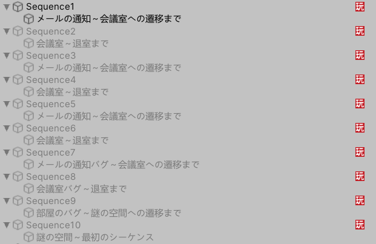
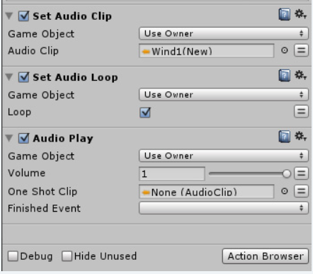
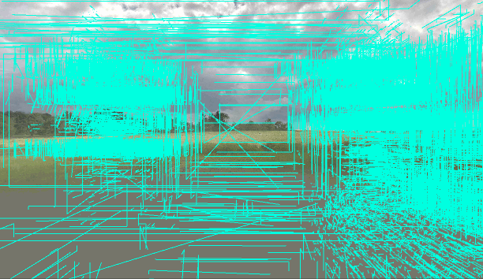
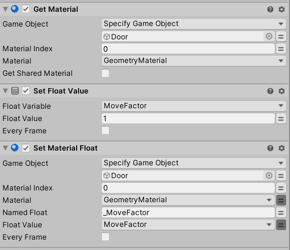
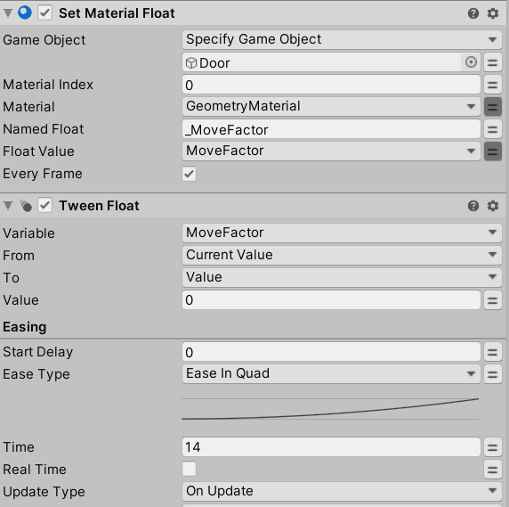
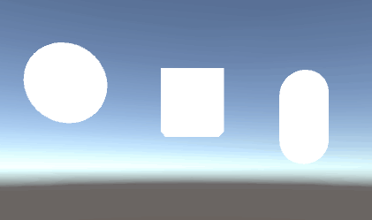
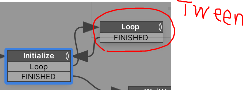

# Styly初挑戦

## バージョン情報

| 諸々名前 | バージョン |
|:-:|:-:|
|  Unity | 2019.3.6f1  |
|  STYLY Plugin | 1.3.0  |

---

## やること
- シーンのアップロード、公開などの基本操作習得  
- 簡単なインタラクションの習得  
  - 物を動かす、座標を移動させる
  - 物を持つ
  - 触ると動く、当たり判定的な  
  - AをBに接触させるとCが起こる  
- PlayMakerの習得
  - カメラの位置の取得、それに応じた処理
- 必要なShaderが問題なく動くか確認  

---

## 作りたい物(案)

### ■リモートワーク in VR
VR空間の中でVR空間に入るという体験を構築する。まあ割とありがち。  
VR空間内でHMDを被らせるのは普通ならやらないダサいUXだが、それをあえてやる。  
伝えたいメッセージは「リモートワーク」、「コロナ禍での真の働き方改革」。  

**【流れ、イメージ】**  
PCの前にHMDが置いてある。PCには会議への招待ダイアログが出ている。  
HMDを被る(頭に接触させる)と別の空間にワープする。
移動先は会議室。そこでは同僚や部下、上司がアバターで参加しており、仕事の打ち合わせを行う。その空間内には時間の概念があり、会議の終了時間になると自動的にワープで自宅に転送される。繰り返すうちに現実がどっちかわからなくなって...  

[シーケンス](ReadME_PDF/Sequences.pdf)

**【必要な素材】**
- 簡素な自宅の部屋
- HMDの3Dモデル
- PCの3Dモデル
- 会議室の3Dモデル
- ワープ演出、エフェクト
- 会議の音、人の声、ワープ音などサウンド

■候補  
[Simple Office](https://assetstore.unity.com/packages/3d/props/interior/simple-office-28730?locale=ja-JP)  
[Home Furniture Pack](https://assetstore.unity.com/packages/3d/props/furniture/home-furniture-pack-137357)  
[HQ ArchViz Conference Room](https://assetstore.unity.com/packages/3d/environments/hq-archviz-conference-room-127663)　使用  
[Modern Interier Room Pack Vol.1](https://assetstore.unity.com/packages/3d/environments/modern-interier-room-pack-vol-1-77021) 使用  
[Notebook PC（PBS）](https://assetstore.unity.com/packages/3d/props/electronics/notebook-pc-pbs-133020) 使用  
[YGS TV](https://assetstore.unity.com/packages/3d/props/electronics/ygs-tv-96583)  
[Modern Desk](https://assetstore.unity.com/packages/3d/props/interior/modern-desk-155462#description)  
[City Street Skyboxes Vol. 1](https://assetstore.unity.com/packages/2d/textures-materials/sky/city-street-skyboxes-vol-1-157401) 使用  
[Skybox Series Free](https://assetstore.unity.com/packages/2d/textures-materials/sky/skybox-series-free-103633?locale=ja-JP) 使用  
[Hyper-Casual Character Stickman sphere head](https://assetstore.unity.com/packages/3d/characters/humanoids/hyper-casual-character-stickman-sphere-head-161922?locale=ja-JP) 使用  

---
## 実際にできたもの

[Remote Work](https://gallery.styly.cc/scene/21577dc6-2acf-43a9-84ef-a870ec11b551)  

>You are invited to a meeting. Let's join a VR workspace. Please note where you are now.

FSMごとにシナリオを定義し、1つのシナリオが終わり次第、次のシナリオのFSMを持つオブジェクトをオンにする手法で実装した。  



---

## 参考リンク
- [UnityからSTYLYにプレハブとシーンをアップロードする方法](https://styly.cc/ja/manual/unity-asset-uploader/)  
- [STYLY インタラクションSDK マニュアル](https://styly.cc/ja/manual/interaction_sdk_manual/)  
- [【Unity入門】PlayMakerを使った初めてのゲーム作り 概要とインストール](https://styly.cc/ja/tips/unity-playmaker-game-beginner-1/)
- [【Unity】ゼロからわかるPlayMaker「超」入門 基礎知識](https://styly.cc/ja/tips/playmaker_coreconcepts/)


---

## 詰まったところ、疑問点など

---
### Editor上からVRでの見え方を確認したい  

下記で解決。  
[STYLYローカルプレビューツール 「UnityシーンをSTYLY StudioにアップロードせずにSTYLY VR アプリで動作確認する方法」](https://styly.cc/ja/manual/styly-local-preview-tool/)  

---

### STYLY_Attr_Equipmentで良い感じに物を持ちたい

実機上でPreviewするとコントローラーと同じ角度に追従した。  
Editor上のシミュレートは40度回転していた。  

```cs
private void MovePosition() 
{
  Vector3 mousePos = Input.mousePosition;
  mousePos.z = distanceFromCamera;

  moveTo = mainCamera.ScreenToWorldPoint(mousePos);
  transform.position = moveTo;
  transform.rotation = mainCamera.transform.rotation;
  transform.eulerAngles += new Vector3(-40,0,0 );
}
```

なので、親オブジェクトの配下に物を置いて持った時に気持ちよくなる角度を探した。   

親に一つ空のオブジェクトを用意。親にIsTriggerにチェックを入れたColliderを用意し、掴むようにした。Blenderで回転いじっても良いが、面倒だったのでこれで対応。  


~~Colliderが2つあるから？なのか稀に右クリックでのオブジェクトのリリースが反応しないことがあった。~~  
→カメラの前に透過Canvasを追従させておりそのオブジェクトがBlocksRaycastsしていた。

親の原点から子の3Dモデルの原点を少しずらして、右端を持つようにした。  
左利き対応はたぶんできないだろうと諦めた。


---

### Playerの原点
Editor上でMainCameraの位置を-5にしておくとゲームビュー及びシーンビューが実機転送時・PlayMode時と同様の位置関係になった。  


---

### 影の品質
影の品質がプラットフォームごとにデフォルトの状態で異なっていた？  
WebGLのPlayerと実機での品質の違いにアップロード＆実機でプレビューして気付いた。  


Editor上で行ったWebGLの設定がWebPlayer上では反映されていなかった。(勘違い？)  
Web版に影の設定を反映させる方法がわからず。もしかしていじっても意味ない？  

下記のように描画距離を絞って影の品質を上げたい。特にQuest。  
【参考リンク】：[2-2 City](https://gallery.styly.cc/scene/074fbc78-39ad-4814-94d1-d681df8d565b)

---

### Lightingが実機とEditorで異なる

>STYLYの仕様上、Point Lightの「Render Mode」を「Important」に設定しないとライトが機能しない

【引用元】：[【Unity】グローバルイルミネーション（GI）基礎知識～STYLYへの反映方法](https://styly.cc/ja/tips/gi-room_yosh_gi/)

けっこうハマった。Preview前、Upload前にLightコンポーネントの設定を自動で変更してくれたら神だなと思った。  
ただ、それはそれでBake用にLight置いてる人とかにとっては邪魔な機能かも？

---

### カメラにUIを追従させたい
目的はフェードインアウトを実装すること。その手段としてUIをカメラの目の前に追従させたかった。  
(意外とStyly上でのフェードインアウトの記事が見当たらなくて、自分のやろうとしていることを疑った)

HierarchyでMainCameraの配下にWorldCanvasを置けば良いと思ったが、  
STYLY_Player(Clone)が動的に生成され、配下にカメラがついて回る仕組みだったのでPlayMakerで実装した。

下記のような記事があったが、そこまで厳密でUIUXに準拠した追従を求めていなかったのでカメラをシーン内から探してその子にUIを配置する仕組みにした。

【参考リンク】：[[Unity/Playmaker]ユーザーに追従するUIの実装方法](https://styly.cc/ja/tips/playmaker_following_ui/)

  

~~Editor上でもシミュレートしたかったので、シーン上通常のカメラはタグを外し、  
Playerのカメラをタグで検索するようにした。~~  
→既存のMainCameraはPlay時に[自動でオフ](https://styly.cc/ja/manual/styly_important_point/)になっていた。  
  

~~アップロード時のシーンのスクショが真っ黒になったのでたぶん正攻法じゃない。  
ただ、そこはあまり問題にならないのでOK。~~  

ここまでのカメラの子にUIを追加する手法は次のシーンへ子オブジェクトが持ち越される？ことを懸念してか、[非推奨](https://document.styly.cc/doc/docs/en/creator/playmaker/creator_playmaker_player_position/)らしい。  


Camera Fade InというActionが用意されていた。Outもある。

下記ドキュメントにも記載があったが、フェード時のブラックアウトをディレイしてその間に何かやりたいときは`Draw Fullscreen Color`で待ってあげる必要があった。  

  

【参考リンク】：[Camera Fade Out](https://hutonggames.fogbugz.com/default.asp?W186)

ここまでやって実機で確認すると`Camera Fade`は動かなかった。  
調べたら同じ状況に対するQA発見。  
【参考リンク】：[ Topic: Camera Fade Out / Fade In works but not in VR (Vive) Help!](https://hutonggames.com/playmakerforum/index.php?topic=14348.0)

最終的にカメラのポジションとローテーションを追従する仕組みをPlayMakerで作った。  
  

NearClipの限界すれすれまでImageを近づけてそれっぽくした。  
(どのシーンか忘れたけど)真っ黒な球体の拡縮とその球体のRenderQueueでイイ感じにフェードインアウトする実装とかがあった気がして、それを作れば良かったのかなーとやり終えてから思った。(マガジンに記事ある？)

---
### Player(Camera)との当たり判定
実行時のカメラにColliderがついていない、つける機能は用意されてない(たぶん)。なので、思いついたのは下記。  

・カメラとの距離で当たり判定っぽくする  
・動的にColliderをつける  
・Collider付きオブジェクトをカメラに追従させる  

Colliderは事故が多そうなので距離にした。  

  

【参考リンク】：[PlayMakerを使って近づくと点灯するライトを作る](https://styly.cc/ja/tips/sensorlight_discont_playmaker/)

---
### コンポーネントのオンオフ
`STYLY_Attr_Equipment`を任意のタイミングでオンオフ制御したかった。  
GetComponentすればいけるだろうと思い、調べたらObject型の変数を定義すれば取得できた。  
【参考リンク】：[Get Component](https://hutonggames.fogbugz.com/default.asp?W820)

最終的に、`Enable Behaviour`というActionを発見し、それがあれば変数すら必要なかった。

【参考リンク】：[Enable Behaviour](https://hutonggames.fogbugz.com/default.asp?W54)

---
### 任意のタイミングでオブジェクトを装備可能にしたい
`STYLY_Attr_Equipment`をオフにしても、Destroyしても掴む機能がオフにならなかった。  
動的に機能の中身を生成しているため？  

任意のタイミングでAddComponentして対応できるか検証したが、エラーを吐いた。  

>NullReferenceException: Object reference not set to an instance of an object
STYLY.Interaction.SDK.Dummy.DummyEquipment.Equip () (at Assets/STYLY_Plugin/STYLY_InteractionSDK/Simulator/DummyImpls/DummyEquipment.cs:114)
STYLY.Interaction.SDK.Dummy.DummyEquipment.OnPointerDown (UnityEngine.EventSystems.PointerEventData eventData) (at Assets/STYLY_Plugin/STYLY_InteractionSDK/Simulator/DummyImpls/DummyEquipment.cs:80)
UnityEngine.EventSystems.ExecuteEvents.Execute (UnityEngine.EventSystems.IPointerDownHandler handler, UnityEngine.EventSystems.BaseEventData eventData) (at D:/UnityEditorFolder/2019.3.6f1/Editor/Data/Resources/PackageManager/BuiltInPackages/com.unity.ugui/Runtime/EventSystem/ExecuteEvents.cs:36)
UnityEngine.EventSystems.ExecuteEvents.Execute[T] (UnityEngine.GameObject target, UnityEngine.EventSystems.BaseEventData eventData, UnityEngine.EventSystems.ExecuteEvents+EventFunction`1[T1] functor) (at D:/UnityEditorFolder/2019.3.6f1/Editor/Data/Resources/PackageManager/BuiltInPackages/com.unity.ugui/Runtime/EventSystem/ExecuteEvents.cs:261)
UnityEngine.EventSystems.EventSystem:Update() (at D:/UnityEditorFolder/2019.3.6f1/Editor/Data/Resources/PackageManager/BuiltInPackages/com.unity.ugui/Runtime/EventSystem/EventSystem.cs:377)

今回は諦めた。

---

### 音の減衰
場面転換で音がプツっと切れるのを避けたかったので探したら`Tween Audio`があった。  

ドキュメントには`Tween Fade`としてまとめられている。(もしかしてドキュメントあんまり更新されてない？)  
【参考リンク】：[Tween Fade](https://hutonggames.fogbugz.com/default.asp?W1717)

---
### 容量との闘い
1つのSceneにやりたいことを広げすぎて200MBにおさまらない気配が出てきた。  
~~シーン(Prefab)軽量化機能欲しい。一方で自分でやれ　とも思う。~~

【参考リンク】：[サイズ容量が大きいアセットを縮小してSTYLYにアップロードする方法](https://styly.cc/ja/tips/filesize-reduction/)

---
### 音源のループ
音源をループさせて再生させる際にAudioPlayというActionの`One Shot Clip`を使うと単発再生になってしまった。  

下記のようにする必要があった。
要は`One Shot Clip`を再生音源と勘違いしていた。PlayとPlayOneShotが合体したイメージ。

Loopにチェックを入れたAudioSourse付きゲームオブジェクトを任意のタイミングでアクティブにする、、が妥当な気がする。

   

【参考リンク】：[Topic: Looping a Oneshot sound  (Read 4422 times)](https://hutonggames.com/playmakerforum/index.php?topic=5428.0)

---
### Material(Shader)の値を操作したい
下記のような表現をMaterial経由でShaderの値を操作して行いたかった。

  

まずMaterialを取得する。
Materialを取得しなくても`Set Material Float`でやりたいことはできるが、SharedMaterialの選択肢を失う。  
ちなみに`Set Material Float`はデフォルトとして選択したMaterialのInstanceを取得する。  
下記がMaterial取得と設定の一連の流れ。  

  

先ほどセットした変数の値を毎フレーム`Set Material Float`することでアニメーションさせた。

  

同じMaterialを持つ複数のオブジェクトに一括で変更加える(SharedMaterialとして利用する)というのが便利だと思った。  
UnityのAnimationは、とあるオブジェクトの1つのMaterialをRenderer経由で参照して値を変更しても  
各MaterialのInstanceを取得してしまう。(あるかもだけど検索しても出ない。Script使えば？で終わりの質問)  
PlayMakerしか使えない状況下でSharedMaterialで取得できるのはありがたい。  
(というかAnimationにSharedMaterialとして参照する方法が欲しい)


【参考リンク】：[Topic: How to get Float Interpolate to, well, interpolate a float?](https://hutonggames.com/playmakerforum/index.php?topic=10412.0)

ここまでEditor上の話で実機(SteamVR、WebPlayer)で確認するとSharedMaterialとして利用できていなかった。  
挙動を簡単に書くと下記。  

**理想：複数あるオブジェクト全てのMaterialの見た目が変わる。**  

  
**実際の挙動：複数あるオブジェクトの中から一つのオブジェクトのMaterialの見た目だけ変わる。**

  

最終的にGetChildNextなどを駆使して特定のオブジェクト配下のオブジェクトを全て取得し、それぞれに処理を与える実装に変更した。  

【参考リンク】：[Topic: Get Next Child](https://hutonggames.com/playmakerforum/index.php?topic=1057.0)

それでも叶えられない挙動があった。全てのオブジェクトを一斉にTween指せるという挙動が実現できなかった。  

下記のLoopのState内でTweenを呼んだが、1つのTweenが終わるまで待つという直列な実行になってしまい、それぞれに対して並列で実行することができなかったので諦めた。
  

配列を作るAction等も同様に試したが、結局取り出す際にTweenに渡す変数が1ずつのため、望んだ結果にはならなかった。(何かしら見落としている可能性有り)  

見落としている解決策があるかもしれないが、ほしいと思ったのは下記2つ。  
**・Tweenを複数のオブジェクトに一斉にかける機能  
・特定のオブジェクトのMaterial、ではなくMaterialそのものの設定をShader経由で変更する機能(Shared Material的な動き)**  

---
### ActionがWeb上で編集中に呼ばれてしまう
開始時、PlayMakerのStartからすぐ繋いだState内でCreate Objectを呼んでいる場合、Webの編集画面上でゲームオブジェクトが生成されてしまっていた。  

その状態でシーンをPublishして確認したところ、既にオブジェクトが生成された状態でPublishされたことが影響して2つのオブジェクトが生成されていた。

Materialの色変更なども同様で、編集中に呼ばれることが望まない挙動に繋がる場面があった。

この現象はWeb版でのみ再現できた。  